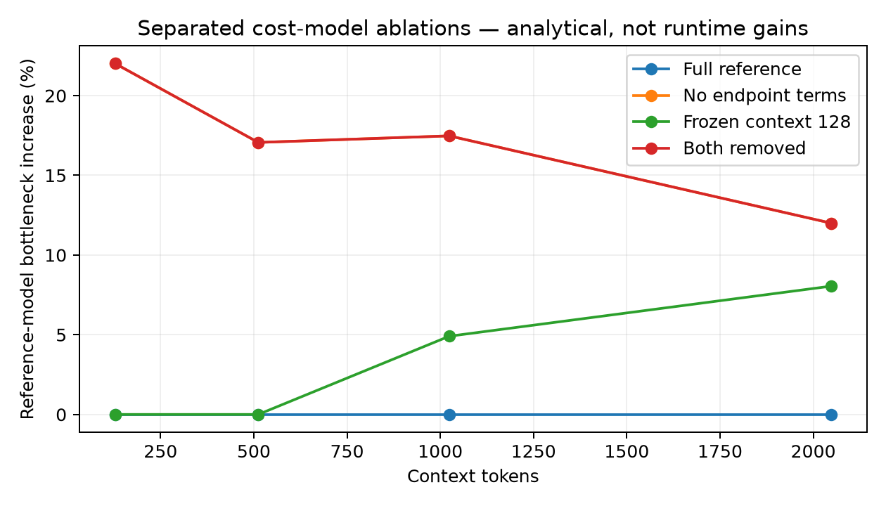
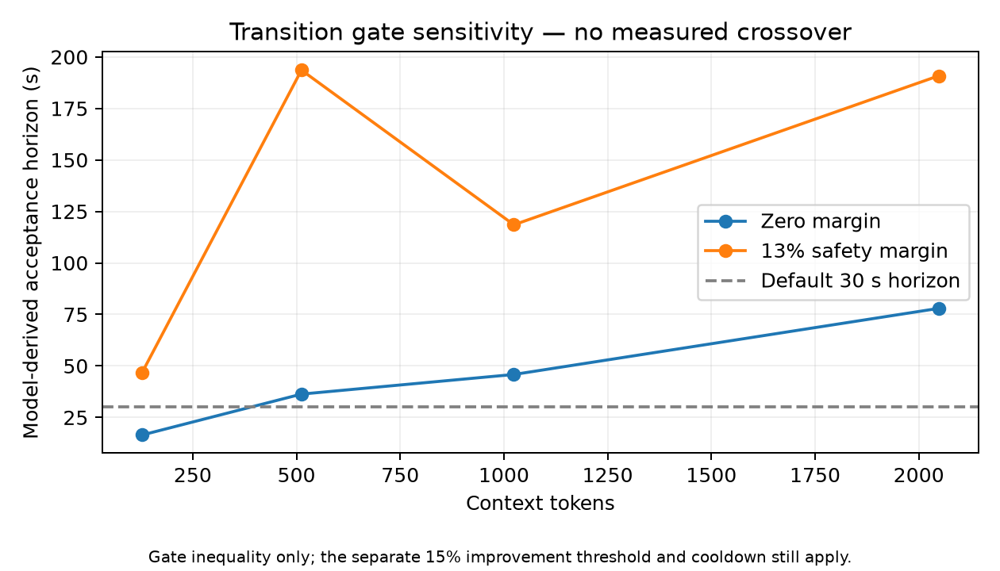
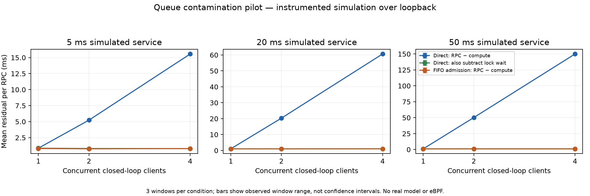
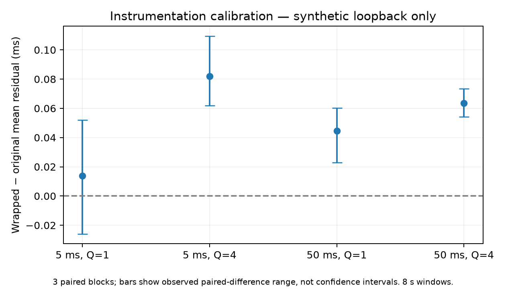

# Paper-focused ablation study — 4 October 2026

Companion manuscript: [KubeEdgeInfer draft](paper/kubeedgeinfer-draft.md).
Data, scripts and exported figures:
[paper-ablations-2026-10-04](data/paper-ablations-2026-10-04/README.md).

## Purpose and evidence status

The paper question remains: **when does a voluntary layer redistribution repay
its complete service cost?** This session advances the measurement and ablation
work needed to answer it. It does not complete a distributed real-model study.

Two new studies were performed: decision/model sensitivity through the production
Go partitioner, and an instrumented Python worker RPC pilot that isolates
compute-lock waiting. Existing real-model component measurements were reused
as approximate parameters, explicitly distinguished from newly measured results.
No product source or protocol was changed. Research scripts are separate artifacts.

| Evidence | Performed now | What it establishes |
|---|---|---|
| Separated endpoint/context grid | 240 deterministic placement/scoring rows | Sensitivity under the stated reference model |
| Policy/transition grid | 18,000 deterministic decision rows | What the actual decider does under changed estimates |
| Direct versus FIFO worker RPCs | 54 completed windows, three per condition | Magnitude of queue contamination in this synthetic setup |
| Partition/controller checks | Existing Go tests passed | Implementation checks within their covered scope |
| Real-model component profiling | Historical repository data, not rerun | Source of approximate model parameters |
| Distributed real-model transitions | Not performed | Still required to demonstrate benefit or harm |
| eBPF versus application telemetry | Not performed | No H3 kernel-telemetry advantage established |

The following sections distinguish analytical and measured results. There are no
per-RPC significance claims or fabricated participant/hardware experiments.

## A1. Separate endpoint and context terms

The earlier ablation switch removed two components together. This experiment
uses a 2×2 design so their effects and interaction are visible:

| Variant | Endpoint costs | Context-dependent layer costs |
|---|---|---|
| Full reference | Retained | Retained |
| No endpoints | Removed | Retained |
| Frozen context | Retained | Frozen at context-128 cost |
| Both removed | Removed | Frozen at context-128 cost |

Each variant selects a placement independently using the production DP. That
placement is then scored under the common full reference model. We vary contexts
128/512/1024/2048, worker-B speeds 1/.93/.8/.7/.5 and hop costs .5/10/80 ms:
60 cases and 240 rows. The exact parameters and source qualifications are in the
data README. Endpoint cost is a fixed 43.8 ms approximation; layer curves are
approximate medians from earlier CPU profiling, not a newly fitted oracle.

At context 2048, equal speeds and .5 ms hop:

| Variant | Chosen layers | Reference-scored bottleneck | Increase over reference optimum |
|---|---|---:|---:|
| Full reference | 16/12 | 158.18 ms | 0% by construction |
| No endpoints | 14/14 | 177.16 ms | 12.00% |
| Frozen context | 18/10 | 170.91 ms | 8.05% |
| Both removed | 14/14 | 177.16 ms | 12.00% |

These are **model-derived differences**, not measured inference speedups. The
reference arm's zero regret is automatic, and removing both terms need not
produce the sum of their individual effects. This case also has identical
reference pipeline-sum latency across the nonempty splits; reducing its
bottleneck is a throughput-model improvement, not a single-request latency gain.

Metric: `reference_regret_frac = B(reference, chosen)/B(reference, optimum)-1`.
Thus the 12% increase above optimum is not the earlier memo's percentage
reduction from the worse split; the denominators differ. Prediction error and
changed assignments are recorded separately, because wrong costs can select
the same split.

## A2. Separate hysteresis from the transition gate

Policies are static-initial, no-hysteresis, hysteresis, gate and gate-force.
Every nonstatic decider starts from the same full-reference baseline and sees
the same changed snapshot. The 15% improvement threshold is retained; cooldown
is held at zero to isolate the gate and threshold, rather than claim a cooldown
ablation. Static is an analytical retained initial assignment, not a live
controller run.

For context 2048, speed-B .7, hop .5 ms, H=30 seconds, margin=.13, and full-chain
transition estimate:

| Policy | Modeled action |
|---|---|
| Static-initial | Keep 16/12 |
| No-hysteresis | Move to 19/9 |
| Hysteresis | Move to 19/9 |
| Gate | Reject the move |
| Gate-force | Move while recording gate rejection |

The candidate improves modeled bottleneck by 18.02%, clearing the 15% threshold.
The gate still rejects because it prices a 14.042-second transition. Under the
same model, ignoring actual transition downtime would overstate useful work.
These are source-code decisions and analytical counterfactuals; no throughput
outcome of a forced move was measured here. Gate-force still respects the
preceding threshold/cooldown conditions.

## A3. Remove transition components and vary horizon/margin

The grid crosses the 60 cases with six horizons, two margins, five transition
variants and five policies: 18,000 rows. The variants retain full-chain replay,
price only ownership-changing layers, omit replay, omit fixed overhead, or omit
all transition cost. They change an estimate; they do not implement a new cache
transfer/recovery backend.

For the context-2048 example above, three layers change ownership:

| Transition estimate | Downtime estimate | Gate action, H=30s and margin=.13 |
|---|---:|---|
| Full-chain replay plus fixed overhead | 14.042 s | Reject |
| Three ownership-changing layers plus fixed overhead | 3.290 s | Reject |
| No replay, fixed overhead only | 2.000 s | Accept |
| Replay only, no fixed overhead | 12.042 s | Reject |
| Zero transition cost | 0 s | Accept |

At zero margin the moved-layers-only estimate accepts, unlike full-chain replay.
That contrast depends on both transition accounting and margin; it must not be
reported as a universal moved-layers-versus-full-chain result.

The zero-margin break-even is 77.945 s, but the gate's 13% margin requires about
190.854 s for this candidate. Both are **model-derived boundaries**, not observed
distributed crossover times. The gate inequality is

`H > T × B_current / (B_current − (1+margin) × B_candidate)`

when its denominator is positive. If not, no finite horizon clears that margin.
The improvement threshold remains a separate precondition.

The context-512, speed-.7 case improves the modeled bottleneck by only 13.79%,
so the default threshold rejects it even at 600 seconds. Margin-derived
boundaries also are not necessarily monotonic in context: discrete assignments
and changes in improvement affect the denominator. A smooth increasing payback
curve cannot simply be assumed from linearly increasing reconstruction cost.

## A4. Isolate compute-lock waiting from RPC residual

Source inspection shows that the worker begins its compute timer **after**
acquiring `compute_lock`. The router subtracts that timer from full RPC duration.
Thus its residual can include queue waiting. The pilot quantifies this mechanism
using an instrumented scratch wrapper around the existing worker:

- Preserve Forward execution and compute timing.
- Time lock acquisition directly and return it in trailing RPC metadata.
- Hold payload, worker implementation and loopback path fixed within a service
  duration; vary 1/2/4 clients and direct versus FIFO admission.
- Use simulated service costs 5/20/50 ms, three repeats, shuffled order, and
  15-second windows with final drain.
- Record client admission wait as well as RPC, compute and server lock wait.

For R=RPC duration, D=compute and Q=lock wait, compare R−D and R−D−Q. The latter
still includes serialization, RPC scheduling and instrumentation; it is not
pure network latency. The actual router/controller/eBPF path is not run here;
the client reproduces the router's arithmetic on genuine worker RPCs.

The complete main matrix contains **54 windows, 66,003 worker RPCs and zero
RPC errors**. Each cell below averages three window means; values describe the
instrumented synthetic loopback setup, not real-model serving.

| Simulated service | Clients | Admission | Mean RPC−compute | Mean lock wait | Mean corrected residual |
|---|---:|---|---:|---:|---:|
| 5 ms | 4 | direct | 15.561 ms | 14.765 ms | 0.797 ms |
| 5 ms | 4 | admitted | 0.798 ms | 0.001 ms | 0.797 ms |
| 50 ms | 1 | direct | 1.129 ms | 0.001 ms | 1.128 ms |
| 50 ms | 2 | direct | 50.253 ms | 49.040 ms | 1.214 ms |
| 50 ms | 4 | direct | 149.984 ms | 148.804 ms | 1.180 ms |
| 50 ms | 4 | admitted | 1.154 ms | 0.001 ms | 1.153 ms |

At 50 ms service, increasing concurrency from one to four raises the uncorrected
residual from 1.129 to 149.984 ms while the
loopback path/payload configuration is unchanged. Directly measured lock waiting
accounts for 99.21% of the latter mean residual. The
queue-corrected residual is 1.180 ms; its three-window mean
range is 1.158–1.223 ms.
FIFO admission produces a 1.154 ms uncorrected residual, but moves waiting
to the client. Mean client completion is 200.113 ms direct versus
204.496 ms admitted. Therefore the smaller RPC residual does not
establish better client latency.

At 5 ms service and four clients, direct/admitted throughput averages
193.40/166.98 completed RPCs/s. Admission reduces
RPC overlap and can reduce utilization; this pilot does not recommend one-at-a-time
admission as a general performance optimization. It exposes which delay component
the communication proxy includes. Three-window ranges and matched-repeat
residual differences are in the raw-data directory; no significance test is claimed.

FIFO does not make waiting disappear: it relocates waiting before the RPC and
may lower worker utilization because requests no longer overlap in transport.
Neither a smaller residual nor a lower internal first-token timer proves
improved end-to-end latency. The finding is measurement contamination under
this setup, not proven controller harm, a superior admission policy or a novel
queueing law.

## A5. Check instrumentation overhead

A supplementary 24-window pilot compares the original worker class with the
instrumented wrapper at service 5/50 ms and concurrency 1/4, with three paired
repeat blocks and eight-second windows. Both servers use the same thread-pool
and transport options. It completed 19,113 RPCs with zero errors. Combined with
the primary study: **78 windows and 85,116 RPCs**, without pooling calibration
into the main per-condition repeat count.

| Simulated service | Clients | Mean wrapped−original residual | Observed paired range |
|---|---:|---:|---:|
| 5 ms | 1 | 0.014 ms | -0.026–0.052 ms |
| 5 ms | 4 | 0.082 ms | 0.062–0.109 ms |
| 50 ms | 1 | 0.045 ms | 0.023–0.060 ms |
| 50 ms | 4 | 0.064 ms | 0.054–0.073 ms |

At 50 ms and four clients, the original worker's mean residual was 149.070 ms
and the wrapped worker's was 149.134 ms in this separate short run. Thus a large
residual also exists without the wrapper. The observed paired differences are
small relative to the main queue effect in this calibration; this is descriptive
support, not an equivalence or universal negligible-overhead claim. The extra
metadata, timing calls and shared-host variability can affect small residuals.

## Interpretation and statistical limits

The repeated unit is a complete window, with three windows per condition. We
report equal-weight means and observed ranges of window means. Matched-repeat
direct/admitted differences are descriptive. RPCs within windows are dependent
and are not counted as independent statistical replicates. The smoke check and
pilot informed this exploratory work; it is not a confirmatory study with
pre-registered thresholds.

The historical model profiles were collected on one CPU VM. Current RPC workers
also share one host, use sleeps rather than model kernels, and carry tiny fixed
payloads. They cannot establish cross-device acceleration, thermal/battery
behavior, WiFi robustness, semantic correctness or real transition-cost tails.
The analytical grid has no independent observed latency/throughput target.

Do not claim that the gate improves sustained real inference, that eBPF improves
control, that cache reconstruction is uniquely novel, or that the 77.9-second
example is a measured crossover. Those require additional evidence.

## Next confirmatory study

| Question | Clean comparison | Required measurements |
|---|---|---|
| Does live adaptation help? | Initially optimized static vs online, same runtime/trace | Full observation throughput, failure/interruption counts, latency tails |
| Does hysteresis help? | No-hysteresis vs hysteresis | Moves, service disruption, short/stable/long traces |
| Does the gate add value? | Hysteresis vs gate, plus eligible gate-force | Actual reload/drain/replay and useful work lost/saved |
| Are replay estimates right? | Predicted vs actual transition at several contexts and active sessions | Full transition distributions and held-out prediction errors |
| Does queue separation help control? | Existing app signal vs queue-separated app signal | Link/queue accuracy, rank correctness and matched service outcome |
| Does eBPF add anything? | Application-only vs optional kernel input, same policy | Signal meaning, monitoring overhead and paired outcome |
| Does distribution help this workload? | Native-batched single device vs feasible replicas vs pipeline | Same model/context/concurrency, capacity and client latency |

Use physical devices for thermal, WiFi and sleep/wake claims. Separate voluntary
changes from worker-loss recovery. Keep short faults, stable intervals and
insufficient-survivor-memory cases. The current loader's full-model peak memory
must be solved or explicitly bounded before a capacity-aggregation claim.

Choose the smallest useful effect and sample-size rule from **fresh real-runtime
pilot runs**, then freeze them before confirmatory runs. The present synthetic
variance is not a valid basis for powering a heterogeneous-device experiment.
Use paired differences with appropriate intervals; retain inconclusive results.
Equivalence needs an explicit equivalence test, not overlapping intervals.

## Paper materials and claim traceability

- [Working manuscript](paper/kubeedgeinfer-draft.md): abstract, introduction,
  related work, system equations, methods, results, discussion and conclusion.
- [Bibliography](paper/references.bib): primary arXiv metadata checked in this
  session. A final submission needs a broader literature review and venue format.
- [Data README](data/paper-ablations-2026-10-04/README.md): exact grids, measurement
  definitions, environment and commands.
- [Existing real-model component report](phase4-partb-findings.md): historical
  measurements with the later full-chain correction. Older preliminary
  “crossover” headlines must not be reused as observed distributed results.
- [Research plan](RESEARCH_PLAN.md): predefined distinction between pilot and
  confirmatory results, benefit/harm/inconclusive outcomes and remaining phases.

This is a substantive prototype/pilot draft with measured ablation evidence.
It is not yet a completed journal evaluation of adaptive distributed inference.
