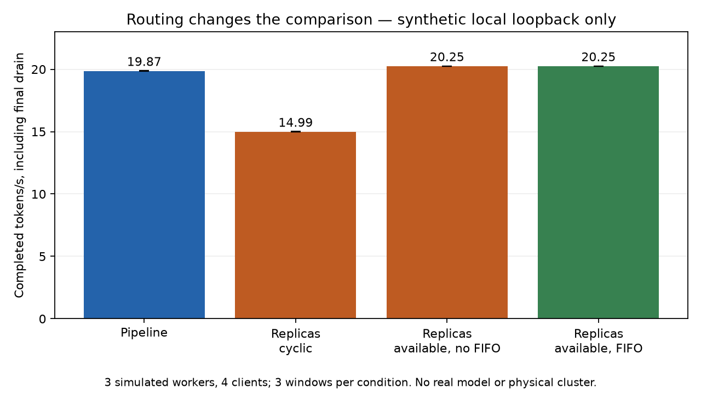
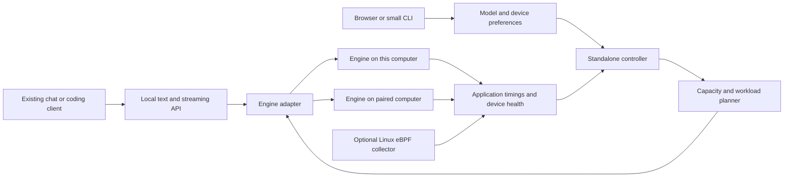

# A practical direction for KubeEdgeInfer

Research date: 4 October 2026. Audience: people like the project owner who want
to use their own computers easily, without installing Kubernetes or another
large infrastructure stack.

Companion documents: [source evidence](PRODUCT_RESEARCH_SOURCES_2026-10-04.md),
[continuation plan](PRODUCT_CONTINUATION_PLAN_2026-10-04.md), and
[local runtime probe](data/product-direction-2026-10-04/README.md).

## Recommendation

Develop **a small, standalone controller for reliable local AI**, starting with
one computer and allowing a second trusted computer to help when useful.
Its user-facing promise should be:

> Run an AI service on the computers I already own. Tell me what will work,
> keep my computer usable, and recover predictably when a participating
> machine becomes slow or unavailable.

The candidate advantage is **measured decisions about when to stay, move,
replicate, or split**, with the cost of loading models and rebuilding request
state counted. That advantage is not established yet. Validate it before
building a broad platform or promising better performance than existing tools.

This is the strongest continuation of the repository because its valuable
assets are an existing reconcile loop, live telemetry, a tested layer
partitioner, generation-aware replay, and a transition gate. A general container
orchestrator would require a different product and substantial additional work.

Keep two routes open: a standalone product if users and measurements justify
it; an adaptive-control component for an existing runtime if they do not.
The second route still develops this project's controller rather than discarding
it. Neither integration is implemented by this research.

## What “like Kubernetes” should mean here

[Kubernetes](https://kubernetes.io/docs/concepts/) manages declared workload
state through automation. The useful analogy is that a user declares a service
and constraints, and a controller keeps it running within available resources.

For this project, that declaration could be: “serve this model locally, leave
headroom for my desktop, and use only my approved machines.” Users should not
need to understand pods, CRDs, placement YAML, or model-layer ranges. A browser
or a short CLI can express the same intent.

There is no need to reproduce container networking, a general storage layer,
an API server, consensus, or a package ecosystem before making that promise
useful. An agent, a local controller, and an inference engine are enough for an
initial version. This is a proposed product shape, not a claim that production
reliability is free.

### Three operations that must stay distinct

| Operation | What it buys the user | Requirement / cost |
|---|---|---|
| Run a whole model on one suitable computer | Simple private chat or coding, usually the lowest operational burden | That computer can fit the model and its requested context; local batching may already be effective |
| Run independent full-model replicas | More concurrent requests; an alternate serving instance | Each replica can fit a whole model; caches and resident-model state influence routing |
| Split one model across computers | Capacity for a model that does not fit on one computer, or pipeline throughput under enough demand | Each shard and its cache fit; communication and transitions are paid on the inference path |

A split pipeline executes a token through its stages in sequence. A single
interactive request does not fill every stage continuously. Independent
requests can overlap across stages. The current partitioner minimizes the
slowest stage, which is appropriate for saturated pipeline throughput; the sum
of stage costs is the more relevant starting point for a lone user's token
latency. The repository already distinguishes those quantities in
`partition.Result` and its measurement notes.

Consequently, “connect more machines” cannot be the performance policy by itself.
[vLLM's deployment guidance](https://docs.vllm.ai/en/latest/serving/parallelism_scaling/)
also recommends a single GPU when a model fits, before moving to distributed
strategies. Actual latency and capacity depend on runtime, quantization,
hardware, context, and request load.

## What this repository actually provides

The following findings come from source inspection of this working tree,
including the user's existing uncommitted edits. They are not claims based only
on the README.

| Existing asset | Product value | Boundary |
|---|---|---|
| `Source` contract and `LocalSource` | Standalone operation is already architecturally supported | Configuration still exposes research/internal parameters |
| Node-agent heartbeats and worker readiness | Discover live workers and remove stale ones | A live transport connection is not model readiness or authenticated membership |
| Exact contiguous-layer DP | A reliable optimizer for its stated snapshot/cost model | No capacity constraint, workload-objective selection, or general topology search in `Input` |
| Hysteresis and transition gate | Avoid some disruptive voluntary repartitions | A fixed planning horizon and component-based transition estimate need distributed calibration |
| Generation-tagged forwards and replay | Recover from changed assignments or lost caches | Full-chain replay can pause requests; current behavior is not seamless migration |
| Measured decoder-speed probe | Real execution slowdown can drive control | One decoder speed ratio need not accurately scale endpoint costs on different devices |
| Kubernetes deployment and experiment harness | Existing reproducibility and provenance | Kubernetes is optional, but this path should keep working for past experiments |
| CPU/CUDA Qwen3 and GPT-2 workers | A functioning research engine with correctness evidence | Limited model families and no production serving features such as continuous batching |
| Existing dashboard | A starting point for explaining system state | It displays research telemetry and fault injection rather than everyday onboarding |

### Blockers to the everyday-user promise

1. **Peak model loading memory.** `Qwen3Backend.load()` loads the full model,
   moves it to the device, retains its assigned modules, and then discards the
   rest. Every worker needs enough transient memory for the full model. This
   undermines the central “larger than any one device” use case until loading
   only assigned weights or adopting a suitable engine is validated.
2. **Memory feasibility is not part of placement.** `partition.Input` contains
   layer costs, workers and links, but no weight/KV/activation memory budgets.
   The telemetry schema has a VRAM field; the partitioner does not use it to
   prohibit an infeasible assignment. Recovery also requires survivor capacity.
3. **The front door is a benchmark interface.** `/generate` consumes token IDs
   or synthesizes a prompt by length; it returns token IDs after generation.
   It lacks text chat, chat templates, streaming, cancellation and normal
   client compatibility. A dashboard alone cannot close this gap.
4. **Installation still has substantial prerequisites.** The standalone
   runbook assumes Linux x86_64, sudo/system packages, a Go build, Python,
   PyTorch, Transformers and model downloads. “No Kubernetes” is true;
   “small effortless installation” is not established.
5. **Transport and membership need a product contract.** The inspected RPC
   paths use insecure channels/ports. Telemetry discovery trusts reported node
   names and worker addresses. A personal multi-device product needs enrollment,
   stable identity, revocation and protected peer communication before automatic
   sharing on a LAN.
6. **Restart state is mostly in memory.** Controller generations reset; workers
   and router accept a backwards assignment generation to accommodate that.
   This is a pragmatic research behavior, but it is not durable fencing against
   two coordinators or stale control messages.
7. **Control operations can disrupt serving.** Assignments acquire the compute
   lock, clear caches on changed shards, and are applied sequentially before
   updating the router. “No worker restart” does not mean no service pause.
8. **Telemetry fallback can mislead.** Requested NVML failure currently falls
   back to the simulator. Production should show unavailable hardware data and
   its source, rather than present synthetic temperature as a hardware reading.

The build check produced roughly 65 MiB for the controller and 21 MiB for the
node-agent in this environment. These unstripped binary sizes exclude inference
libraries and weights. They are useful packaging inputs, not download-size
promises. Partition and controller Go tests passed; no real-model experiment
was rerun because this environment has no installed Torch/Transformers.

## Local runtime probe: why mode and admission policy matter

The session ran **63 synthetic localhost windows and 1,524 requests**, with no
request errors: 54 main-matrix windows, six available-replica comparison windows,
and three FIFO replica windows. Existing worker/router processes were used;
compute was simulated with sleeps. No real model, physical network, model-memory
allocation, controller, gate or eBPF was exercised.

For one concurrent client, a one-worker pipeline averaged
7.07 completed tokens/s; a three-stage
pipeline averaged 6.94. Extra stages
provided no single-request gain in this configuration. At four clients and
three simulated workers, the comparison depended on routing:

| Mode / admission | Mean completed tokens/s, including drain |
|---|---:|
| Three-stage pipeline, focused comparison | 19.87 |
| Full-model replicas, per-client cyclic | 14.99 |
| Full-model replicas, available without FIFO | 20.25 |
| Full-model replicas, available with FIFO | 20.25 |

The cyclic comparator made the pipeline appear preferable. A better admission
policy removed that apparent throughput advantage. Non-FIFO admission also
allowed a maximum observed queue wait of 31.73 seconds; FIFO reduced it to
2.27 seconds in its follow-up. These are exploratory, descriptive observations
from three windows per condition, not significance or product speedup claims.
A real engine's batching, hardware contention, network and memory costs can
change the result.

The router's internal first-token timing excludes central admission wait, and
its current HTTP endpoint returns a complete response rather than streaming.
Thus its TTFT is not the client's first streamed token latency. The follow-ups
retain client completion and routing-wait times. Replicas only become a feasible
real-model alternative when each participating device can fit the whole model.
See the [probe design, raw results and reproduction commands](data/product-direction-2026-10-04/README.md).

## Alternatives and their effect on the decision

This comparison uses primary upstream descriptions. “Documented” does not mean
independently benchmarked or verified on the user's devices. There is no universal
winner across these different jobs.

| Alternative | Already useful for | Implication for us |
|---|---|---|
| [Ollama](https://docs.ollama.com/faq) or [LM Studio](https://lmstudio.ai/docs/developer/core/headless) | Running a local model, managing residency and concurrent requests | Reuse an engine. A single-machine user should not have to adopt distributed machinery |
| [Open WebUI](https://docs.openwebui.com/getting-started/quick-start/connect-a-provider/starting-with-ollama/) plus existing engines | Familiar chat and basic distribution over several Ollama connections | Connect a frontend before writing another general chat app |
| [NVIDIA PAIR](https://github.com/NVIDIA/Personal-AI-Router) | Desktop device pairing, managed Ollama/LM Studio engines, routing whole requests | Particularly close to the user's desired experience; convenience and pairing alone do not differentiate us |
| [exo](https://github.com/exo-explore/exo) | Automatic local AI clusters and topology-aware split execution | Automatic sharding and a dashboard are already occupied; validate support against a pinned release |
| [LocalAI](https://localai.io/docs/features/distribute/index.print.html) | Federation, model sharding and broader local-AI capabilities | A general local-AI runtime rewrite would duplicate existing functionality |
| [GPUStack](https://github.com/gpustack/gpustack) | GPU/engine management and serving on managed hardware | Competes directly with a generic AI-cluster-management platform |
| [Parallax](https://github.com/GradientHQ/parallax) | Heterogeneous pipeline serving and dynamic request routing | Dynamic scheduling is already represented in available projects |
| [Flock](https://github.com/llmpy/flock) | Small Go control plane, CLI/UI and serving-engine orchestration | Very close concept; its documentation labels deployment scope beta and documents additional sharding prerequisites |
| [dnet](https://github.com/firstbatchxyz/dnet) | Apple-device profiling and heterogeneous execution planning | Profiling and automatic assignment are not unique product features |
| [LiteLLM](https://docs.litellm.ai/docs/routing) | Routing policies, retries, fallbacks and cooldowns | A simple endpoint router is insufficient differentiation |
| [Ray Serve LLM](https://docs.ray.io/en/latest/serve/llm/index.html) / [KServe](https://kserve.github.io/website/docs/intro) | More extensive distributed/production serving infrastructure | Useful comparison stacks; not the first-install target for this user |

PAIR explicitly documents whole-request routing, rather than memory pooling or
model sharding. Its [services description](https://github.com/NVIDIA/Personal-AI-Router/blob/develop/services/readme.md)
describes queue depth plus smoothed GPU pressure. Our candidate extension is
measured performance and transition economics, not merely observing GPU use.
This is a possible distinction to test, not proof that PAIR lacks all related
features.

Flock's [architecture](https://github.com/llmpy/flock/blob/main/ARCHITECTURE.md)
separates implemented sharding/bootstrap code from a planned general placement,
drain and replication scheduler. Its current RPC sharding description uses
free-RAM ordering. That offers a concrete comparator for placement research,
but its implementation and release must be checked before a matched benchmark.

LocalAI has separate P2P, infrastructure-backed distributed, and MLX distributed
modes. An older P2P limitation is not evidence against the newer modes. Similarly,
exo's installation instructions and [platform roadmap](https://github.com/exo-explore/exo/blob/main/PLATFORMS.md)
are not fully aligned about Linux support. Do not build a business argument from
an assumed missing platform feature.

### If the goal turns out to be ordinary app hosting

[Uncloud](https://uncloud.run/) already offers multi-machine Compose deployment,
WireGuard networking and HTTPS, while explicitly avoiding automatic rescheduling.
[Dokploy](https://docs.dokploy.com/docs/core/deployment-options) distinguishes a
single host, independent remote servers and Swarm replication.
[Coolify](https://coolify.io/docs/core/infrastructure/scaling/overview) documents
multi-server deployment and separate load-balancing responsibilities.

These are credible alternatives for hosting web apps. The inspected repository
does not currently provide general image builds, container lifecycle, ingress,
secrets, storage placement, backups or safe stateful-service failover. Extending
it into that market would involve much more new work than continuing inference
control. A generic app platform is therefore a weak first direction for this
specific codebase, even if it is a useful category overall.

### If the eBPF work suggests a general desktop monitor

[Netdata](https://github.com/netdata/netdata) already documents broad resource,
process, hardware and network monitoring. [Glances](https://github.com/nicolargo/glances)
offers a cross-platform system monitor. This repository's collectors are useful
inputs, but its distinctive implemented decision/action is inference layer
assignment. A general “make my computer faster” assistant would need much broader
measurement, causal diagnosis and safe workload controls. Neither automatic
diagnosis nor arbitrary-process tuning is established by this code. Keep useful
health explanations inside the inference product rather than pivoting to a broad
system optimizer without a separately validated user problem.

## Where the project can earn a reason to exist

The product hypothesis is that personal devices are shared with their owners:
a gaming session or compile changes capacity; a laptop closes; a link becomes
slow; models and caches are expensive to move. Users need a service that adapts
without making their computer unpleasant to use. Whether enough users encounter
this problem frequently remains unknown; browsing projects cannot validate demand.

Start with **one owner and one to three trusted computers**, serving chat or a
coding assistant through a familiar client. This is a target segment hypothesis,
not a market-size estimate. A lab or small group could be an adjacent segment
later. Public volunteer swarms, enterprise multi-tenancy, arbitrary workloads,
and automatic internet networking multiply scope before this hypothesis is tested.

The strongest candidate behavior is an honest recommendation with execution:

- “This model fits here; a second computer would add overhead for this chat.”
- “You have several simultaneous requests; independent copies are preferable.”
- “This model needs two computers; here is the expected memory headroom.”
- “The slowdown appears temporary; moving would interrupt more work than it saves.”
- “A computer disconnected; service is recovering on the surviving capacity.”
- “The remaining devices cannot hold this model; reconnect a device or select a
  smaller model.”

Those are proposed UX messages. Their claims need measurements and confidence
levels. Do not promise temperature, battery, cost or completion time estimates
that the selected backend cannot actually support.

### Product value and paper novelty are separate

[Petals](https://arxiv.org/abs/2312.08361) already reports fault-tolerant
distributed inference and heterogeneous device churn.
[Parallax](https://arxiv.org/abs/2509.26182) combines model allocation with
request-time pipeline selection. [EdgeFlow](https://ieeexplore.ieee.org/document/11619197/)
reports hybrid KV transfer/recomputation on a real edge platform; here only its
publisher abstract was accessible.

Recent work also targets [compiled Intel AI-PC shards](https://arxiv.org/html/2608.19147v1)
and [load-aware CPU/GPU tensor scheduling](https://arxiv.org/html/2607.10183v1).
The Intel paper explicitly documents reliability/security limitations, but that
does not make generic fault tolerance new. Its published multi-user versus
single-user throughput comparison must not be relabeled as a same-concurrency
comparison with this project.

Therefore, “first adaptive edge inference,” “first thermal-aware inference,”
“first cost-aware migration,” and “first real-device split model” are not defensible
headlines for our product or paper. The existing candidate paper remains a measured
decision boundary for whole-layer redistribution including actual reload and
full-chain replay, with matched policy comparisons. See the
[September novelty memo](NOVELTY_RESEARCH_2026-09-23.md).

The repository's 77.9-second example is a **predicted break-even from measured
components**, not an observed distributed crossover. The earlier Codespace
simulator benchmark observed controller reactions and recovery, but reported no
netem performance advantage in that configuration. These are reasons to validate
the controller carefully, not numbers to market as a user speedup.

## Proposed system shape

The diagram describes a proposal. The current repository does not implement
the text API, engine adapters, preference model or paired-device enrollment.

Use the current Go controller as the starting point. Consolidate its local
management responsibilities behind one executable and a small persisted state
store; run the inference engine as a managed local process. “One installer” may
contain several processes. Avoid a new database server or message broker for
one-owner local operation unless a demonstrated requirement justifies it.

Use one supported, prebuilt inference engine for the first usable version.
An Ollama-compatible adapter is a low-disruption way to test useful whole-model
serving. A llama.cpp/GGUF adapter is worth a separate spike for direct runtime
packaging and memory-efficient loading. The upstream
[RPC guide](https://github.com/ggml-org/llama.cpp/blob/master/tools/rpc/README.md)
is not a product-security layer or a guarantee of hot repartitioning. Keep the
current Hugging Face workers as the research path until feature parity and
correctness are established.

Engine adapters must advertise capabilities. An endpoint that can generate text
may not support arbitrary layer assignments, state transfer, or mid-request
replay. Do not translate the controller's `AssignLayers` calls into unsupported
operations and assume they are cheap. An engine restart can be a valid planned
transition if the complete cost and service interruption are included.

### Planning in the right order

1. Exclude unapproved, unavailable or incompatible devices.
2. Establish memory feasibility for weights, active KV cache, activations,
   runtime overhead and temporary transition memory, with desktop headroom.
3. Compare a whole model on the best eligible device with replicas or a split
   using observed workload and the user's latency/throughput objective.
4. Prefer stable residency and cache/session affinity unless the expected
   improvement repays the actual additional transition cost.
5. Apply voluntary changes at request boundaries or after draining by default.
   Treat unexpected device loss separately.
6. Explain inability to serve when capacity is insufficient. A smaller model
   is a user choice; silently changing it changes the service contract.

For a simple grouped-query-attention model, a useful starting estimate is
`KV bytes ≈ 2 × assigned layers × KV heads × head dimension × bytes per element
× active context tokens`, summed over active requests. The factor 2 accounts
for keys and values. Validate against runtime measurements; paged allocation,
cache sharing, quantization and architecture-specific layouts can change the
allocated amount. Do not add RAM and VRAM as independent capacity on devices
that share the same physical memory.

### Recovery boundaries

The controller needs durable membership and a controller epoch/fencing rule
before two concurrent control processes can safely manipulate one service.
Persist intent; derive live health; distinguish downloaded, loaded, ready,
draining, recovering and unavailable states. A resumed laptop should pass
compatibility/readiness checks before joining a serving layout.

A text stream also needs a recovery contract. The current research replay
retains generated token IDs. Arbitrary external engines do not necessarily
expose the same cache or reproduce identical outputs. Model digest, tokenizer,
template, seed and backend behavior matter. Default to a clear interrupted
stream rather than silently duplicating output or changing models. Tool calls
must never be replayed as though they were harmless text generation.

### Transition economics: a detail that changes the default decision

The implemented gate compares `H/current` with `(H - T)/optimal`, where `T`
is predicted downtime and both costs are in milliseconds per saturated token.
The zero-margin boundary is `H* = T × current / (current - optimal)`.
With required fractional advantage `m`, the acceptance boundary becomes
`H > T × current / (current - (1+m) × optimal)`, provided the denominator is
positive. If it is nonpositive, no finite horizon clears that margin under
these stationary assumptions.

Using the committed context-2048, speed-0.7 predicted costs (225.7571 ms staying,
185.0857 ms after moving) and the current 14.04224-second transition estimate:

| Margin | Model-derived required horizon |
|---|---:|
| 0 | 77.9 seconds |
| Default 0.13 | About 190.9 seconds |

These are **algebraic predictions**, not observed crossover times. The default
30-second horizon therefore rejects this candidate. The 77.9-second research
example is not the default-margin acceptance horizon. Fault ending, queueing,
concurrency, changing context and a subsequent move back can alter actual
benefit. The calculation is preserved in
[gate-margin-prediction.json](data/product-direction-2026-10-04/gate-margin-prediction.json).

### eBPF's role

Keep kernel telemetry optional for the everyday product. Application timings
and engine/device health should support basic operation without privileged
collectors. Enable eBPF as a Linux diagnostics/control input only when a matched
experiment shows a useful decision improvement relative to its setup and
monitoring cost. The current `ebpf+app` setting prefers eBPF and falls back to
application data; it is not a demonstrated sensor-fusion estimator.

There is also an application-metric confound visible in the code: the router
subtracts worker `compute_ms` from RPC duration, but the worker starts its compute
timer **after acquiring `compute_lock`**. Thus the residual includes waiting for
that lock under concurrency, along with transport and serialization. It is not
a pure network measurement. Add separate queue-wait and execution timestamps
before interpreting this input as link cost. Its usefulness for decisions still
needs an ablation; this source-level observation does not quantify its magnitude.

The previously observed sRTT/application-transport discrepancy is a hypothesis
about measurement, not proven ACK/compute causality. Basic operation on another
OS should not depend on reproducing Linux probes. Platform support is a separate
engineering milestone and cannot be obtained merely by cross-compiling Go.

## Direction decision

| Direction | Fit with existing code | User value hypothesis | Recommendation |
|---|---|---|---|
| General Kubernetes replacement | Low beyond the reconcile-loop idea | Easier app deployment, but crowded and broad | Do not choose as the first continuation |
| Another local chat application | Low/moderate | Convenient interface, already available | Connect existing clients |
| General desktop resource monitor/optimizer | Moderate for some Linux telemetry, low for broad actions/platforms | Explain slowdowns and improve responsiveness | Keep scoped health diagnostics; avoid a broad pivot initially |
| Personal AI controller with measured adaptation | High for control/research core; substantial product work remains | Stable service on shared, changing devices | Best direction to validate |
| Always split models over all devices | High for current mechanism | Capacity aggregation | Make this a qualified mode; not a default promise |
| Adaptive planner integrated with an existing runtime | High for the decision core; adapter work required | Better decisions with less duplicated infrastructure | Strong fallback or parallel validation route |
| Complete a focused measurement paper | Very high | Establish when transitions are actually beneficial | Continue the existing experiment plan |

The recommendation is conditional on three answers: can users install and
operate it without repeated help; does measured adaptation beat a strong simple
baseline on relevant hardware; and does that benefit matter often enough to
justify maintaining another product? The continuation plan turns these into
explicit work and stop/go decisions.

## Outstanding uncertainty

- The user's actual operating systems, memory, GPU and number of machines.
- Frequency of the proposed pain among users; no interviews were conducted.
- Distributed real-model gains, transition-cost tails and peak memory.
- Compatibility and controllability of an optimized external inference engine.
- A maintained integration point in PAIR, LocalAI or another runtime.
- Whether application-only measurements are sufficient for the desired policy.
- Whether adaptation is worth its engineering/operational cost at personal scale.

These do not block a research recommendation. They do block credible platform,
speedup, battery-saving, reliability and market-demand claims.

## Implementation follow-up: objective and admitted-work control

The product-direction hypothesis now has an opt-in implementation: latency
placement minimizes sequential token cost, throughput placement retains minimax
stage cost, and automatic mode selects between them from admitted concurrency.
A remaining-work gate caps its planning horizon using the router's unproduced
output budget. Idle or unavailable demand holds voluntary changes; recovery
still bypasses the gate.

The [real-model experiment](../results/objective-aware-2026-10-04/README.md)
keeps latency/throughput comparisons separate from the automatic-policy matrix.
Its [measured report](../results/objective-aware-2026-10-04/analysis/REPORT.md)
and raw decisions show both useful objective choices and transition overhead.
This implements and tests a candidate systems contribution. It does not resolve
the product uncertainties above or establish algorithmic novelty. Probabilistic
gating, oracle arms and self-calibration remain analytical replay helpers rather
than live controller features.
