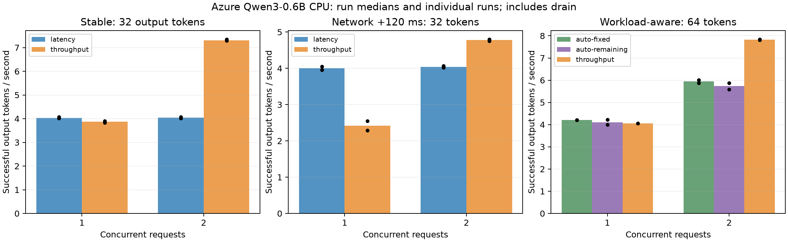

# Live objective and remaining-work experiments

Completed **32/32 runs**; **240 measured requests**, **0 failed**; 0 excluded runs.

Bars show median whole-run throughput including request drain; dots show individual runs. The two output budgets are separate workloads. Client completion is measured externally.

| Matrix | Condition | Concurrency | Arm | Runs | Tokens/s | Client p50 (s) | Moves | Rejections |
|---|---|---:|---|---:|---:|---:|---:|---:|
| demand | stable | 1 | auto-fixed | 2 | 4.21 | 15.21 | 0 | 0 |
| demand | stable | 1 | auto-remaining | 2 | 4.11 | 15.29 | 0 | 0 |
| demand | stable | 1 | throughput | 2 | 4.05 | 15.78 | 0 | 0 |
| demand | stable | 2 | auto-fixed | 2 | 5.94 | 16.55 | 2 | 0 |
| demand | stable | 2 | auto-remaining | 2 | 5.73 | 19.18 | 2 | 4 |
| demand | stable | 2 | throughput | 2 | 7.83 | 16.35 | 0 | 0 |
| objective | network | 1 | latency | 2 | 4.00 | 8.01 | 0 | 0 |
| objective | network | 1 | throughput | 2 | 2.42 | 12.53 | 3 | 0 |
| objective | network | 2 | latency | 2 | 4.04 | 15.88 | 0 | 0 |
| objective | network | 2 | throughput | 2 | 4.78 | 12.85 | 4 | 0 |
| objective | stable | 1 | latency | 3 | 4.03 | 7.94 | 0 | 0 |
| objective | stable | 1 | throughput | 3 | 3.88 | 8.26 | 0 | 0 |
| objective | stable | 2 | latency | 3 | 4.05 | 15.78 | 0 | 0 |
| objective | stable | 2 | throughput | 3 | 7.30 | 8.74 | 0 | 0 |

## Observations

In stable 32-token trials at concurrency two, throughput placement delivered 80.5% more tokens per second than latency placement (ratio of group medians). At concurrency one, latency placement avoided an extra stage and hop.

Under the +120 ms network condition at concurrency one, latency placement delivered 65.4% more tokens per second than throughput placement. These are descriptive results from two repeats.

In the short stable 64-token matrix at concurrency two, the fixed-throughput arm reached 7.83 tokens/s, compared with 5.94 for auto-fixed and 5.73 for auto-remaining. Automatic arms pay for starting with latency placement and switching during the run. The gate's accepted/rejected decisions demonstrate its live behavior; this matrix does not establish that automatic selection or remaining-work gating improves performance.

Fixed-input eight-token greedy checks matched the shared reference in **12/12 demand runs**.

These small repeated trials demonstrate an objective tradeoff and exercise automatic selection and remaining-work gating. They do not establish statistical significance or a universal advantage. Auto arms start with latency placement; transition cost, cooldown and measured remaining budget can delay switching. Compare them as complete policies, including that starting behavior.

Inspect [per-run metrics](per-run.csv), [paired repeats](paired-comparisons.json), and each raw decisions.json for accepted and rejected transitions. Probabilistic gates, oracle arms and calibration remain separate analytical replay evidence.
